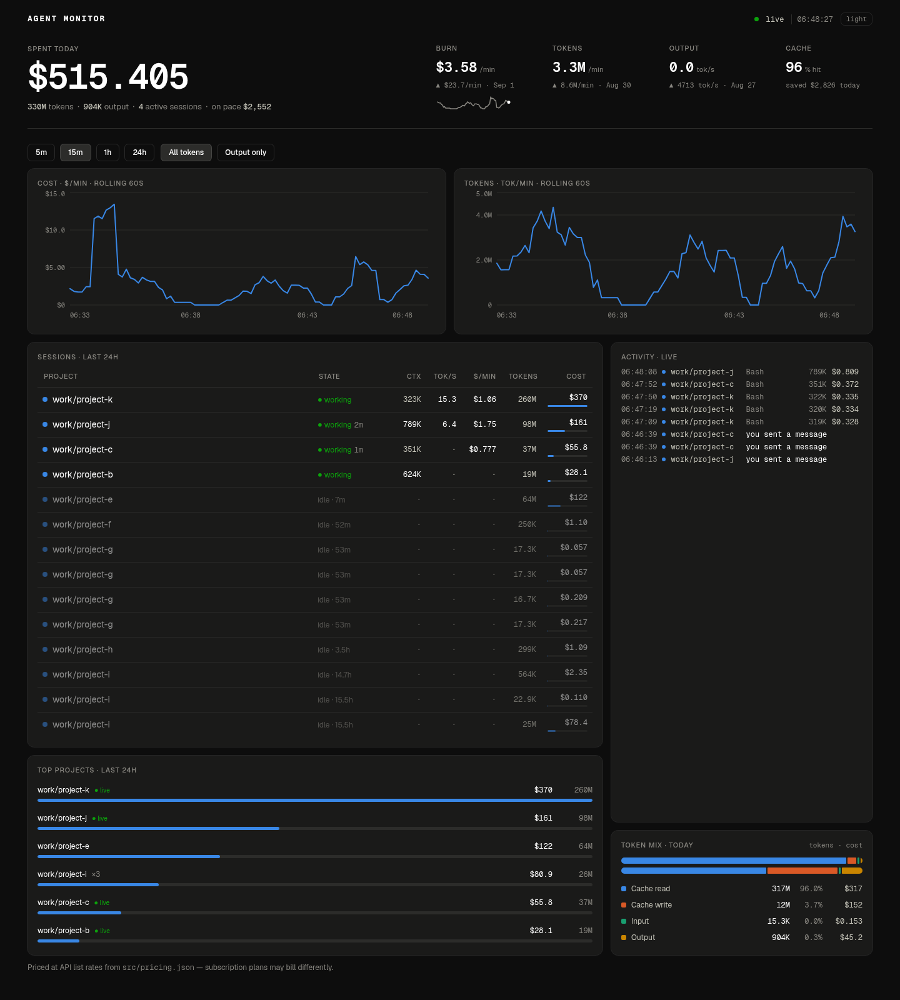
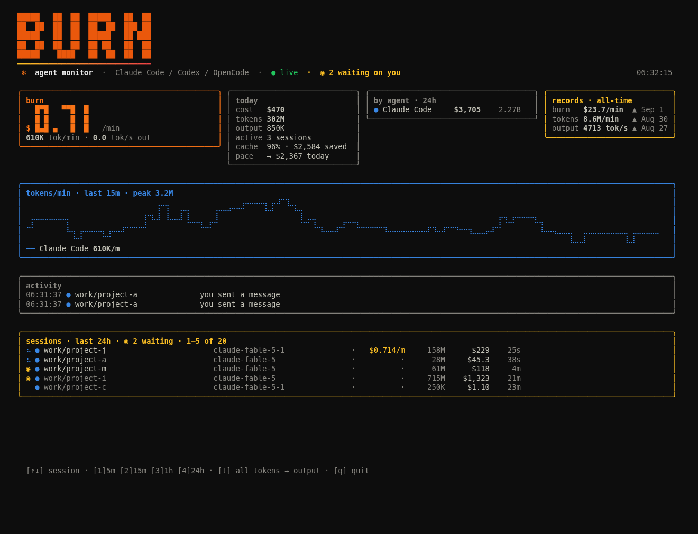
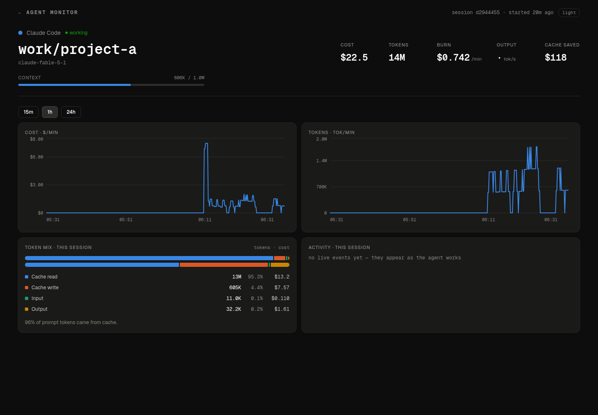

<p align="center">
  
</p>

<h1 align="center">BURN · agent monitor</h1>

<p align="center">
  Live token &amp; cost burn-rate for your coding agents — <b>Claude Code</b>, <b>Codex</b>, <b>OpenCode</b>.<br>
  A web dashboard, a full-screen TUI, desktop notifications, and an always-on collector. All local. No proxy, no wrapper, no prompts ever read.
</p>

<p align="center">
  
</p>

---

## Why

Coding agents burn tokens fast and quietly. `ccusage` tells you what yesterday cost; nothing tells you what *this minute* costs, which session is stuck, or that an agent finished twenty minutes ago and has been waiting on you since. BURN tails the session logs your agents already write and turns them into a live instrument:

- **$/min · tok/min · output tok/s** — rolling live rates, plus all-time records
- **Session states** — `working / ◉ needs you / idle`, derived from transcript structure (stop reasons, tool-use blocks) — never from message content
- **Desktop notifications** when a session finishes and is waiting on you, when one turn runs 15+ minutes, when a session looks like a runaway loop, or when you cross a budget
- **Context meters** per session — how close each one is to compaction
- **Cache economics** — hit rate, "cache saved you $X", and token-vs-cost mix (spoiler: cache reads are ~95% of tokens and output is ~10% of cost)
- **Live activity ticker** — tool names, turn boundaries, compactions, model switches, with the token/cost delta of each step
- **Per-session pages**, 5m/15m/1h/24h ranges, forecast to midnight, light & dark themes

Numbers cross-check against `ccusage daily` to within rounding — including the **subagent transcripts** that most tools miss (on a parallel-agent workload that's a 30%+ undercount).

## Sources

| Agent | Reads | Notes |
|---|---|---|
| Claude Code | `~/.claude/projects/**/*.jsonl` | per-response `usage`, cache read / 5m / 1h write split, deduped by `message.id + requestId`; includes `<session>/subagents/*.jsonl` |
| Codex CLI | `~/.codex/sessions/YYYY/MM/DD/*.jsonl` | cumulative `token_count` events, diffed per rollout; rate-limit headroom when reported |
| OpenCode | `~/.local/share/opencode/opencode.db` | read-only SQLite via `node:sqlite`; assistant-message `tokens` + OpenCode's own `cost`, diffed as rows update |

Gemini CLI isn't supported: its local chat files carry no token usage.

## Install

Requires **Node ≥ 22.5** (for the built-in `node:sqlite`). Linux desktop notifications use `notify-send` if present.

```sh
git clone https://github.com/Anay0305/burn.git
cd burn
npm ci && (cd web && npm ci && npm run build)
ln -s "$(pwd)/bin/burn" ~/.local/bin/burn      # or anywhere on your PATH
```

## Run

```sh
burn              # full-screen TUI — standalone, tails logs directly
burn web          # collector + Next.js dashboard → http://localhost:3000
burn serve        # collector only (SSE/API on :4090 + a lightweight vanilla UI)
burn ask "which project cost the most this week?"   # Claude over aggregates (needs Anthropic creds)
```

Everything starts populated: the collector backfills the last 26h of logs (`BACKFILL_HOURS` to change) and, after the first run, restores from its own SQLite store in milliseconds.

### Always-on collector (recommended)

```sh
cp scripts/systemd/agent-monitor.service ~/.config/systemd/user/
# edit WorkingDirectory if the repo isn't at ~/Desktop/Projects/agent-monitor
systemctl --user enable --now agent-monitor.service
```

With the service running, `burn web` just attaches the dashboard, notifications never miss a session, and records persist. Budget alerts are opt-in via `Environment=` lines in the unit:

| Variable | Effect |
|---|---|
| `BURN_ALERT_PER_MIN=15` | notify when burn stays above $15/min for 5 minutes |
| `BURN_ALERT_TODAY=2500` | notify once when today's spend crosses $2500 |
| `AGENT_MONITOR_NOTIFY=0` | disable all desktop notifications |

<p align="center">
  
</p>

### TUI keys

`↑/↓` select a session (chart follows it) · `esc` back to all agents · `1/2/3/4` = 5m/15m/1h/24h · `t` all tokens ↔ output only · `q` quit

It runs in the alternate screen buffer with synchronized-output frames (no flicker), fills the terminal height, and draws braille line charts.

<p align="center">
  
</p>

## Pricing

`src/pricing.json` — USD per 1M tokens, matched by exact id → date-stripped id → longest prefix → longest substring (so gateway ids like `antigravity-claude-sonnet-4-6` price at the embedded model's rates).

- Anthropic: cache read = 0.1× input, cache write = 1.25× (5m TTL) / 2× (1h TTL)
- OpenAI-style: `cached_input_tokens` billed at `cachedIn`; cache writes are ordinary input
- Unknown models still count tokens; their cost is excluded and the UI says so

Costs are **API list rates**. Subscription plans bill differently — treat the dollar figures as "what this would cost on the API".

## Privacy

Set `BURN_MASK=1` on the collector or TUI to replace every project path with a stable pseudonym (`~/work/project-a`, `-b`, …) in all output — for screenshots, screen-shares and demos. The screenshots in this README were taken that way.

BURN reads *metadata*: token counts, model ids, timestamps, stop reasons, tool **names**, and the working-directory path. It never reads or stores prompt text, tool inputs/outputs, or message content. The only network call in the whole project is `burn ask`, which sends per-day/per-project/per-model **aggregates** to the Claude API — and only when you invoke it.

## Architecture

```
src/
  server.js          collector: tails sources, SQLite persistence, SSE + JSON API, notifications
  lib/store.js       events, sessions, rolling rates, buckets, states, peaks, cache & forecast math
  lib/tailer.js      resumable JSONL tailer (offsets + per-file state persisted)
  lib/db.js          node:sqlite (~/.local/share/agent-monitor/events.db, 14-day retention)
  lib/notify.js      notify-send: waiting-on-you, stuck turn, runaway, budget
  sources/           claude-code.js · codex.js · opencode.js  (~100 lines each; add your own)
  tui/               Ink + htm, no build step
  cli/ask.js         burn ask
web/                 Next.js + shadcn/ui + Recharts; proxies the collector same-origin
public/              zero-dependency vanilla dashboard, served by the collector itself
```

Adding an agent: a source provides `listFiles()` and an `onLine(file, json)` that calls `store.add({...})` with per-event deltas (see `codex.js` for JSONL, `opencode.js` for SQLite polling), then gets a color slot in the UIs.

## License

MIT © Anay Gupta
